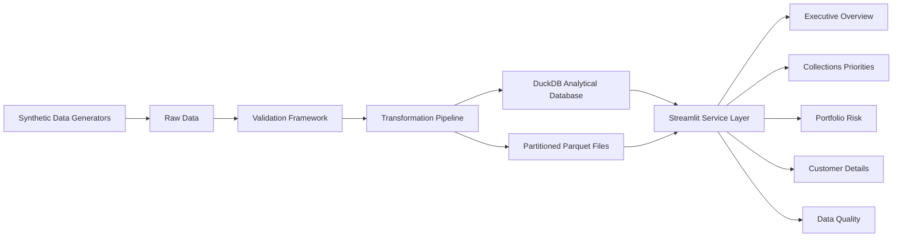

# Business & Technical Requirements — Streamlit Override

This is the full project brief. `.cursorrules` in the repo root is a condensed
version for quick reference; this file is the source of truth for detail
(exact KPI lists, page-by-page requirements, chart standards, config schema,
phase breakdown, and definition of done).

---

# Streamlit Dashboard Override

Replace every Power BI requirement in the original project brief with an open-source Streamlit implementation.

The final project must not depend on Power BI, proprietary BI software, DAX, Power Query, or a `.pbix` file.

## 1. Updated technology stack

Use:

* Python 3.11+
* uv (package / environment management)
* Streamlit
* pandas
* numpy
* Plotly
* DuckDB
* PyArrow
* Faker
* Pydantic
* PyYAML
* pytest
* Ruff
* Git
* Docker

Optional supporting libraries:

* streamlit-aggrid for advanced interactive tables
* streamlit-option-menu for navigation
* great-expectations or Pandera for additional validation
* Kaleido for exporting Plotly charts
* openpyxl for Excel exports

Prefer standard Streamlit functionality unless an external component adds clear value.

All dashboard functionality must remain open source.

## 2. Updated project structure

See repository layout in the root README / actual folder tree (already scaffolded).

## 3. Streamlit application architecture

Build a multipage Streamlit application.

Use:

* `app/Home.py` as the landing page
* Streamlit's native multipage navigation
* One Python module for each dashboard page
* Shared components for repeated charts, filters, KPI cards, and tables
* A service layer for database queries and business calculations
* DuckDB as the primary analytical database
* Parquet as the main file-based analytical format

Do not place SQL queries directly throughout page files.

Store reusable queries in SQL files, query service modules, and parameterised functions.

Page modules should focus primarily on layout and presentation.

## 4. Application entry point

The application must run with:

```bash
streamlit run app/Home.py
```

The data pipeline must run separately with:

```bash
python -m src.run_pipeline
```

Also support:

```bash
python -m src.run_pipeline --small
python -m src.run_pipeline --skip-defects
python -m src.run_pipeline --config config/project_config.yaml
```

The dashboard must detect when the analytical database is missing and display a clear instruction to run the pipeline rather than failing with an unhandled error.

## 5. Landing page

Create a professional landing page containing: project title, brief business scenario, dashboard objectives, reporting date, data refresh status, number of customers, number of invoices, total portfolio exposure, risk-model disclaimer, navigation instructions, and a summary of the five dashboard pages.

Include a visible disclaimer:

> This application uses a fictional dataset and a demonstration risk methodology. It is not a production credit-rating model, regulatory model, or substitute for professional underwriting judgement.

## 6. Global dashboard behaviour

Provide consistent filtering across appropriate pages: reporting/snapshot date, country, region, industry, risk category, customer status, account manager, collections owner, credit-insurance status, currency, business unit.

Implement filters through reusable functions. Use `st.session_state` for selected reporting date, selected customer, shared filter values, navigation context, and customer drill-down state.

Add a reset-filters control and display an active-filter summary. Do not silently apply filters that users cannot see.

## 7. Performance requirements

Use `st.cache_resource` for DB connections, `st.cache_data` for query results, DuckDB SQL aggregation, Parquet predicate filtering, precomputed monthly snapshots, pagination/row limits, lazy loading, and efficient Plotly figures.

Avoid repeatedly loading full CSV files on every interaction. Do not perform expensive risk calculations inside Streamlit page rendering — this belongs in the pipeline. Invalidate caches safely when the data refresh timestamp changes.

## 8. Page 1: Executive overview

KPIs: total exposure, overdue exposure, percentage overdue, credit-limit utilisation, claims submitted, recoveries, customers exceeding limits, month-over-month deterioration.

Include: KPI cards with MoM change, monthly exposure/overdue trend, risk-category distribution, ageing distribution, top-ten concentration, country/industry exposure summary, high-risk exposure trend, insured vs uninsured exposure, dynamic executive commentary.

Suggested visuals: line chart (trends), stacked bar (risk composition), horizontal bar (ageing), treemap/ranked bar (concentration), waterfall (monthly deterioration drivers).

KPI formatting examples: `£12.4M`, `£850K`, `17.3%`, `92 customers`.

Add contextual help via tooltips or expandable sections.

## 9. Dynamic executive commentary

Generate deterministic, rule-based commentary from selected dashboard data. No external generative-AI service.

Examples: "Overdue exposure increased by 8.4% compared with the previous month." / "The Manufacturing sector accounts for 31% of high-risk exposure." / "The ten largest customers represent 42% of current portfolio exposure." / "Twenty-seven customers currently exceed their approved credit limits."

Commentary must be based on calculated metrics and change with filters. Never hard-code unsupported findings.

## 10. Page 2: Collections priorities

Worklist columns: customer, outstanding balance, overdue balance, oldest days past due, overdue invoice count, risk category, risk score, credit-limit utilisation, average days to pay, % invoices paid late, dispute balance, collection-priority score, recommended priority, recommended action, collections owner.

Filters: collections owner, priority, risk category, days-past-due range, ageing bucket, country, industry, dispute status, credit-limit breach, claim eligibility.

Support: search by name/ID, multi-column sorting, conditional formatting, CSV download, Excel download where practical, row selection, navigation to customer-detail page. Use native Streamlit dataframe selection or an open-source grid only where it adds clear value — never a hard requirement.

Recommended actions: immediate escalation, senior collections review, contact within 24 hours, standard collection contact, monitor, resolve dispute, consider credit hold, prepare insurance claim.

Add a panel explaining why the selected customer received its priority — show the score breakdown, not just the final score.

## 11. Page 3: Portfolio risk

Show: exposure by country, exposure by industry, top-customer concentration, top-ten customer share, largest customer share, risk-rating distribution, ageing buckets, high-risk exposure trend, critical-risk exposure trend, credit-limit-utilisation distribution, insured vs uninsured exposure, claims/recoveries by insurer.

Suggested visuals: ranked horizontal country bar, ranked industry bar, Pareto chart (concentration), stacked ageing chart, risk-category donut/bar, monthly high-risk exposure line, utilisation histogram, insured vs uninsured stacked bar.

Prefer ranked charts over maps unless a map materially improves understanding.

Concentration-risk panel: largest customer share, top-5 share, top-10 share, largest country share, largest industry share — clearly state how percentages are calculated.

## 12. Page 4: Customer details

Search/select one customer. Summary: customer ID, name, country, industry, annual revenue, account manager, collections owner, status, credit-insurance status, current credit limit, current exposure, available credit, overdue exposure, credit-limit utilisation, risk score, risk category, collection priority, recommended action.

Tabs: Overview, Invoices, Payments, Risk history, Credit decisions, Claims, Data-quality issues.

Include exposure/overdue/risk-score/risk-component/credit-limit history, invoice & payment transaction tables, claims history, credit-review history, ageing analysis, payment behaviour metrics.

Keep selected customer persistent across pages. Download controls for invoice, payment, claims, risk, and credit-decision history.

## 13. Page 5: Data-quality monitoring

Show: missing customer identifiers, duplicate invoices, payments larger than invoice values, invalid dates, missing risk categories, failed validation checks, validation pass rate, critical failures, records tested, failed records, last successful refresh, last successful validation run.

Include: validation-status KPI cards, validation-failure trend, failures by table, failures by check, severity distribution, detailed validation-results table, failed-record sample viewer, refresh-status indicator, row-count trend, stale-data warning.

Filters: validation status, severity, table, check name, validation run, date.

Status labels: Passed / Warning / Failed. Use accessible labels and icons in addition to colour — never colour alone.

## 14. Dashboard calculations

Replace all DAX measures with tested Python/SQL metric functions: total invoiced, total payments, total exposure, overdue exposure, % overdue, available credit, credit limit, credit-limit utilisation, customers exceeding limits, open/overdue invoice counts, claims submitted/approved, recoveries, recovery rate, average & weighted-average days past due, high-risk/critical-risk exposure, high+critical %, top-10 exposure & concentration, largest-customer concentration, MoM exposure/overdue/deterioration change, validation checks/failures/pass rate, critical validation failures, last successful refresh.

Place calculations in `app/services/metrics.py`, SQL aggregation files, and pipeline-generated analytical tables.

Test edge cases: zero balances, empty filtered datasets, missing credit limits, negative values, no previous-month data, no submitted claims, no validation failures.

## 15. Chart standards

Reusable chart functions in `app/components/charts.py`. Each should: accept a prepared DataFrame, validate required columns, return a Plotly figure, include a descriptive title, use appropriate axis labels, consistent number formatting, hover info, handle empty data safely, avoid clutter.

Risk-category colour convention: low = green, medium = amber, high = orange, critical = red, neutral = blue/grey. Accessible contrast; never colour alone.

Avoid: 3D charts, excessive pie charts, decorative gauges without decision value, too many categories per chart, unreadable legends, unnecessary animation.

## 16. KPI-card component

Support: title, current value, formatted value, previous-period value, absolute change, % change, positive/negative interpretation, help text, warning state, critical state. A decrease is not always favourable — the interpretation must be configurable per metric.

## 17. Table standards

Support financial/percentage/date formatting, risk-category labels, priority labels, sorting, search, conditional formatting, row-count display, download controls, empty-state messaging. Never render tens of thousands of rows by default — use a default row limit, pagination, top-N selection, explicit "load more," and full-extract download.

## 18. Export functionality

Support CSV, Excel where practical, PNG chart export where supported, printable customer summary where practical. Exports must respect active filters. Filenames include dataset name, reporting date, export timestamp, and must be sanitised. Never include credentials or internal paths in exports.

## 19. Application configuration

`config/project_config.yaml` extended with a `dashboard`, `database`, and `application` section (see `config/project_config.yaml` in this repo). Validate configuration before launching the app.

## 20. Styling

Streamlit theme configuration, limited custom CSS, consistent spacing/card design, accessible typography, responsive columns, clear titles, visible filter controls, helpful empty states.

Colour direction: dark navy headings, neutral background, blue for neutral financial values, amber for warnings, red for critical issues, green for favourable outcomes. Custom CSS must not make the app fragile or hide core Streamlit functionality unnecessarily.

## 21. Streamlit configuration

`.streamlit/config.toml`: theme, wide layout, upload limits, dev options, browser settings — no secrets. `.streamlit/secrets.toml.example` with placeholder values only; real `secrets.toml` is gitignored.

## 22. Error handling

Handle: missing database, empty query results, invalid configuration, DB connection failures, missing columns, invalid reporting dates, no previous-period data, export failures, corrupted source files. User-friendly messages; log technical details without exposing internals. No bare `except`.

## 23. Testing the Streamlit solution

Test metric calculations, SQL query outputs, filter behaviour, risk-category/date filtering, customer selection, empty datasets, KPI direction logic, collection-priority explanations, export functions, DB connection handling, configuration validation.

Separate business logic from rendering so it's testable without a browser. Use small deterministic fixtures. Use Streamlit's app-testing utilities for smoke tests where practical.

## 24. Deployment

`Dockerfile`, `docker-compose.yml`, deployment instructions, env-variable docs, health-check guidance, persistent-data guidance.

Container should: install dependencies, generate demo data when explicitly requested, launch Streamlit, expose the standard port, run as non-root where practical.

```bash
docker compose up --build
```

Document options: local Docker, Streamlit Community Cloud, Render, Railway, Fly.io, a Linux VM, Kubernetes as a future enhancement. No dependency on one commercial provider.

## 25. Updated README requirements

Project summary, business scenario, screenshots, walkthrough/demo placeholder, tech stack, architecture diagram, pipeline architecture, app architecture, repo structure, local setup, Docker setup, pipeline execution, dashboard launch, data-model summary, risk methodology, collections-priority methodology, validation framework, page descriptions, testing instructions, deployment guidance, limitations, future enhancements, demonstration-model disclaimer.

```bash
uv sync
uv run python -m src.run_pipeline --small
PYTHONPATH=. uv run streamlit run app/Home.py
```

```powershell
uv sync
uv run python -m src.run_pipeline --small
$env:PYTHONPATH = "."
uv run streamlit run app/Home.py
```

## 26. Updated architecture diagram



## 27. Updated development phases

**Current progress:** Phases 1–2 complete. **Next: Phase 3 — Risk analytics.**

| Phase | Scope | Status |
|-------|--------|--------|
| 1 | Foundation | **Done** |
| 2 | Synthetic data | **Done** |
| 3 | Risk analytics | **Next** |
| 4 | Validation | Planned |
| 5 | Streamlit dashboard | Planned |
| 6 | Testing and optimisation | Planned |
| 7 | Documentation and deployment | Planned |

**Phase 1 — Foundation (done):** repository structure, Python environment, configuration, logging, DuckDB connection utilities, Streamlit landing page, basic navigation.

**Phase 2 — Synthetic data (done):** customer/invoice/payment/credit-decision/claims generators, date dimension, data-quality issue injection, CSV/Parquet writers, DuckDB load via `python -m src.run_pipeline`. Implementation plan: [phase2_plan.md](phase2_plan.md). Column contracts: [data_model_phase2.md](data_model_phase2.md).

**Phase 3 — Risk analytics (next):** risk model, risk history, collections-priority model, monthly snapshots, portfolio aggregations, executive metrics.

**Phase 4 — Validation:** validation framework, validation history, failed-record samples, pipeline metadata, refresh monitoring.

**Phase 5 — Streamlit dashboard:** shared filters, KPI cards, all 5 pages, exports, empty states, error handling.

**Phase 6 — Testing and optimisation:** unit tests, query tests, pipeline tests, Streamlit smoke tests, cache strategy, query optimisation, large-table handling.

**Phase 7 — Documentation and deployment:** README, data dictionary, risk methodology, dashboard walkthrough, portfolio case study, Docker deployment, screenshot guidance, demo instructions.

## 28. Updated definition of done

Synthetic-data pipeline runs successfully; data reproducible from a fixed seed; CSV and Parquet outputs generated; DuckDB database created; risk scores calculated; collections priorities calculated; historical snapshots avoid future-data leakage; configurable data-quality defects can be injected; validation checks identify injected defects; tests pass; Streamlit app launches; all five pages functional; filters affect the correct visuals; customer drill-down works; collections-priority explanations visible; filtered data downloadable; empty states/errors handled safely; acceptable performance with the full demo dataset; Docker deployment works; documentation complete; demonstration-risk-model disclaimer visible.

## 29. Cursor instructions

Inspect the existing repository before changing files. Treat this Streamlit override as higher priority than any earlier Power BI instructions.

Remove/replace: Power BI folders, DAX requirements, Power Query requirements, `.pbix` references, Power BI theme files, and any Power BI-specific star-schema instructions unnecessary for Streamlit. Retain dimensional/analytical modelling principles where they improve query performance and maintainability.

Before implementing the dashboard, present: the proposed Streamlit architecture, the page-navigation approach, the shared-filter strategy, the DuckDB query strategy, the caching strategy, and the first files to create.

Implement incrementally — do not generate every file in one response. After each phase: list files created/changed, run relevant tests, run the small data pipeline, launch/smoke-test the app where possible, report errors honestly, fix failures before proceeding.
