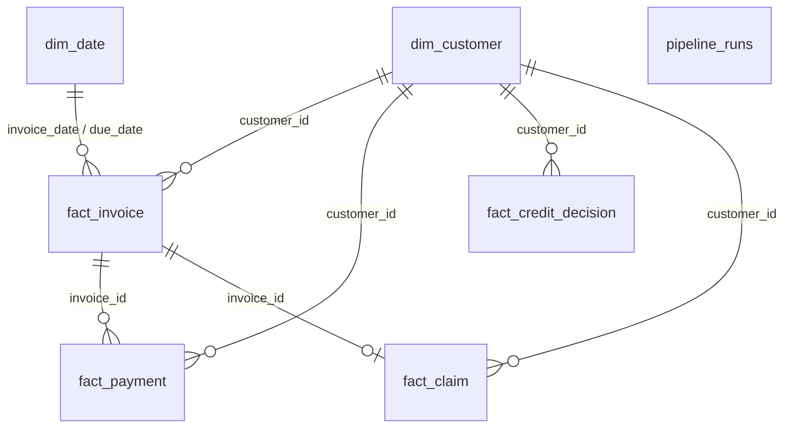

# Phase 2 data model (raw synthetic entities)

> **Phase 2 complete.** These tables are produced by
> `python -m src.run_pipeline` into CSV, Parquet, and DuckDB.

Column contracts, grain, and foreign keys for generators and DuckDB DDL.
Full data dictionary remains Phase 7 (`docs/data_dictionary.md`).
Risk / collections / snapshot tables are Phase 3+.

DDL source: [`sql/create_schema.sql`](../sql/create_schema.sql).

Home page already expects `dim_customer`, `fact_invoice` (with
`outstanding_amount`, `invoice_date`, `status` in
`open` / `overdue` / `partial`), and optionally `pipeline_runs`
(`status`, `finished_at`).

---

## Entity relationship (Phase 2 only)

Logical date joins use `dim_date.full_date` (or `date_key` =
`YYYYMMDD`); DuckDB DDL does not enforce date FKs.

---

## `dim_date`

| Column | Type | Notes |
|--------|------|--------|
| date_key | INTEGER PK | `YYYYMMDD` |
| full_date | DATE | Calendar date |
| year | INTEGER | |
| month | INTEGER | 1–12 |
| month_name | VARCHAR | e.g. January |
| quarter | INTEGER | 1–4 |
| is_month_end | BOOLEAN | |

**Grain:** one row per calendar day in the pipeline history window
(`pipeline.history_months`, anchored to the run as-of date).

---

## `dim_customer`

| Column | Type | Notes |
|--------|------|--------|
| customer_id | VARCHAR PK | Stable synthetic ID |
| name | VARCHAR | |
| country | VARCHAR | Filter dimension |
| region | VARCHAR | Filter dimension |
| industry | VARCHAR | Filter dimension |
| annual_revenue | DOUBLE | Nullable allowed |
| account_manager | VARCHAR | Filter dimension |
| collections_owner | VARCHAR | Filter dimension |
| status | VARCHAR | e.g. active, inactive, watchlist |
| credit_insurance_status | VARCHAR | insured, uninsured, partial |
| credit_limit | DOUBLE | |
| currency | VARCHAR | ISO 4217 (e.g. GBP) |
| business_unit | VARCHAR | Filter dimension |
| created_date | DATE | Within or before history window |

**Grain:** one row per customer.

---

## `fact_invoice`

| Column | Type | Notes |
|--------|------|--------|
| invoice_id | VARCHAR PK | |
| customer_id | VARCHAR FK → dim_customer | |
| invoice_date | DATE | Within history window |
| due_date | DATE | ≥ invoice_date |
| invoice_amount | DOUBLE | ≥ 0 |
| outstanding_amount | DOUBLE | ≤ invoice_amount for clean rows |
| currency | VARCHAR | Usually matches customer |
| dispute_flag | BOOLEAN | |
| status | VARCHAR | `open`, `overdue`, `partial`, `paid`, `written_off` |

**Grain:** one row per invoice.

Ageing buckets and days-past-due are derived later (Phase 3), not stored here.

---

## `fact_payment`

| Column | Type | Notes |
|--------|------|--------|
| payment_id | VARCHAR PK | |
| invoice_id | VARCHAR FK → fact_invoice | |
| customer_id | VARCHAR FK → dim_customer | Denormalised for filters |
| payment_date | DATE | ≥ linked invoice_date (clean data) |
| payment_amount | DOUBLE | > 0 for clean rows |

**Grain:** one row per payment event (partial or full).

---

## `fact_credit_decision`

| Column | Type | Notes |
|--------|------|--------|
| decision_id | VARCHAR PK | |
| customer_id | VARCHAR FK → dim_customer | |
| decision_date | DATE | |
| previous_limit | DOUBLE | |
| new_limit | DOUBLE | |
| decision_type | VARCHAR | increase, decrease, new, review, hold |
| decision_reason | VARCHAR | Free text / coded reason |

**Grain:** one row per credit-limit decision (sparse history per customer).

---

## `fact_claim`

| Column | Type | Notes |
|--------|------|--------|
| claim_id | VARCHAR PK | |
| customer_id | VARCHAR FK → dim_customer | |
| invoice_id | VARCHAR FK → fact_invoice | Optional |
| claim_date | DATE | |
| claim_amount | DOUBLE | ≥ 0 |
| status | VARCHAR | submitted, approved, rejected, settled |
| insurer | VARCHAR | |
| recovery_amount | DOUBLE | ≥ 0; typically ≤ claim_amount when settled |

**Grain:** one row per insurance claim / recovery record.

---

## `pipeline_runs` (stub)

| Column | Type | Notes |
|--------|------|--------|
| run_id | VARCHAR PK | |
| started_at | TIMESTAMP | |
| finished_at | TIMESTAMP | Nullable while running |
| status | VARCHAR | running, success, failed |
| random_seed | INTEGER | From config |
| customer_count | INTEGER | Customers generated this run |
| notes | VARCHAR | Optional |

**Grain:** one row per pipeline execution. Populated in step 11; Home uses
latest `status` / `finished_at` for refresh messaging.

---

## Out of scope (later phases)

Risk scores, risk history, collections priority, monthly snapshots,
`executive_metrics`, `customer_snapshot`, and validation tables are **not**
defined here.
