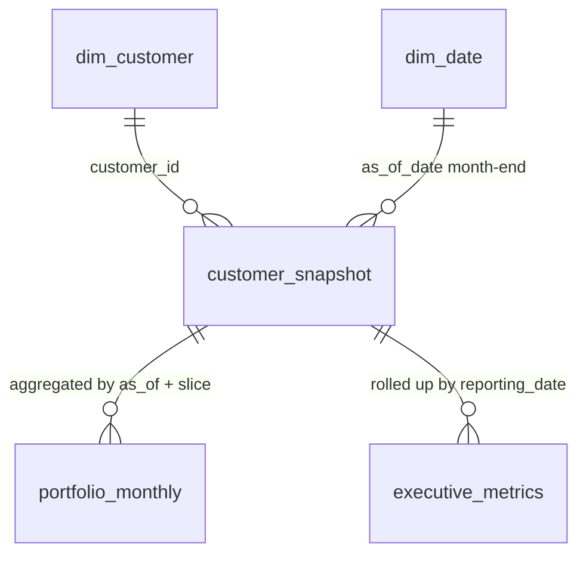

# Phase 3 data model (analytical tables)

> **Phase 3 in progress.** Column contracts for risk / collections analytics.
> Scoring and population happen in later Phase 3 steps; this document locks
> grain, columns, and point-in-time rules. Full data dictionary remains Phase 7.

DDL source: [`sql/create_schema.sql`](../sql/create_schema.sql).
Plan: [`phase3_plan.md`](phase3_plan.md).

Home already prefers `executive_metrics` (`total_exposure`, `reporting_date`)
then `customer_snapshot` (`outstanding_amount`, `as_of_date`) for portfolio
exposure when those tables exist.

---

## Entity relationship (Phase 3 analytical)

Logical date joins use month-end dates from `dim_date` (`is_month_end` and
`full_date <=` pipeline as-of). DuckDB DDL does not enforce date FKs on
analytical tables.

---

## Point-in-time rules (no future leakage)

For each month-end `as_of` used as `customer_snapshot.as_of_date`:

| Rule | Detail |
|------|--------|
| Invoice cutoff | Only invoices with `invoice_date <= as_of` |
| Outstanding | `max(0, invoice_amount - sum(payments where payment_date <= as_of))` — do **not** use static `fact_invoice.outstanding_amount` for historical months |
| Overdue | Reconstructed outstanding where `due_date < as_of` |
| Credit limit | Latest `fact_credit_decision.new_limit` with `decision_date <= as_of`, else `dim_customer.credit_limit` |
| Claims / decisions | Exclude rows with event dates after `as_of` |

Risk and collections scores on a snapshot row must be functions only of
features known at that `as_of` (plus config).

---

## `customer_snapshot`

| Column | Type | Notes |
|--------|------|--------|
| customer_id | VARCHAR PK (composite) | FK → dim_customer |
| as_of_date | DATE PK (composite) | Month-end date |
| customer_name | VARCHAR | From dim_customer.name |
| country | VARCHAR | Denormalised filter dimension |
| region | VARCHAR | Denormalised filter dimension |
| industry | VARCHAR | Denormalised filter dimension |
| account_manager | VARCHAR | Denormalised filter dimension |
| collections_owner | VARCHAR | Denormalised filter dimension |
| status | VARCHAR | e.g. active, inactive, watchlist |
| credit_insurance_status | VARCHAR | insured, uninsured, partial |
| currency | VARCHAR | ISO 4217 |
| business_unit | VARCHAR | Denormalised filter dimension |
| outstanding_amount | DOUBLE | PIT reconstructed outstanding |
| overdue_amount | DOUBLE | PIT overdue portion of outstanding |
| credit_limit | DOUBLE | PIT credit limit |
| available_credit | DOUBLE | `credit_limit - outstanding_amount` (may be negative) |
| utilisation | DOUBLE | Outstanding / credit_limit when limit &gt; 0 |
| oldest_days_past_due | INTEGER | Max DPD among overdue invoices at as_of; 0 if none |
| overdue_invoice_count | INTEGER | Count of overdue invoices with outstanding &gt; 0 |
| dispute_balance | DOUBLE | Outstanding on invoices with dispute_flag |
| avg_days_to_pay | DOUBLE | Nullable if no paid invoices observable at as_of |
| pct_invoices_paid_late | DOUBLE | Nullable if no paid invoices; share paid after due_date |
| ageing_bucket | VARCHAR | Bucket from oldest DPD (values set by analytics config) |
| risk_score | DOUBLE | Demonstration score 0–100 |
| risk_category | VARCHAR | `low`, `medium`, `high`, `critical` |
| risk_comp_ageing | DOUBLE | Explainability component |
| risk_comp_utilisation | DOUBLE | Explainability component |
| risk_comp_payment | DOUBLE | Explainability component |
| risk_comp_overdue_ratio | DOUBLE | Explainability component |
| risk_comp_dispute | DOUBLE | Explainability component |
| collection_priority_score | DOUBLE | Demonstration priority score |
| recommended_priority | VARCHAR | Priority tier from config thresholds |
| recommended_action | VARCHAR | One of BRD §10 locked action list |
| coll_comp_risk | DOUBLE | Explainability component |
| coll_comp_overdue | DOUBLE | Explainability component |
| coll_comp_dpd | DOUBLE | Explainability component |
| coll_comp_dispute | DOUBLE | Explainability component |
| coll_comp_limit_breach | DOUBLE | Explainability component |

**Grain:** one row per `(customer_id, as_of_date)` for every month-end in
`dim_date` with `as_of_date <=` pipeline as-of (`DEFAULT_AS_OF_DATE`).

**Home dependency:** `outstanding_amount`, `as_of_date` (fallback exposure
query when `executive_metrics` is empty).

**Recommended actions (BRD §10, locked):**

- immediate escalation
- senior collections review
- contact within 24 hours
- standard collection contact
- monitor
- resolve dispute
- consider credit hold
- prepare insurance claim

---

## `portfolio_monthly`

| Column | Type | Notes |
|--------|------|--------|
| as_of_date | DATE PK (composite) | Month-end |
| slice_type | VARCHAR PK (composite) | One of: `country`, `industry`, `risk_category`, `ageing_bucket`, `credit_insurance_status` |
| slice_value | VARCHAR PK (composite) | Dimension member for that slice |
| customer_count | INTEGER | Distinct customers in the slice |
| outstanding_amount | DOUBLE | Sum of snapshot outstanding |
| overdue_amount | DOUBLE | Sum of snapshot overdue |
| high_critical_exposure | DOUBLE | Sum outstanding where risk_category in (`high`, `critical`) |

**Grain:** one row per `(as_of_date, slice_type, slice_value)`.

Built from `customer_snapshot` only (no re-query of facts).

---

## `executive_metrics`

| Column | Type | Notes |
|--------|------|--------|
| reporting_date | DATE PK | Month-end; equals snapshot `as_of_date` for that month |
| total_exposure | DOUBLE | Portfolio outstanding at reporting_date |
| overdue_exposure | DOUBLE | Portfolio overdue at reporting_date |
| pct_overdue | DOUBLE | overdue_exposure / total_exposure when total &gt; 0 |
| credit_limit_utilisation | DOUBLE | Aggregate utilisation KPI (definition in scoring steps) |
| claims_submitted | DOUBLE | Claim amounts with claim_date in the month (or as-of policy set in Step 08) |
| recoveries | DOUBLE | Recovery amounts attributable in the period |
| customers_exceeding_limits | INTEGER | Customers with utilisation &gt; 1 at as_of |
| mom_exposure_change | DOUBLE | Nullable on first month-end |
| mom_overdue_change | DOUBLE | Nullable on first month-end |
| high_critical_exposure | DOUBLE | Outstanding in high + critical risk |
| customer_count | INTEGER | Customers in snapshot for that date |
| invoice_count | INTEGER | Invoices observable at as_of (invoice_date ≤ as_of) |

**Grain:** one row per month-end `reporting_date`.

**Home dependency:** `total_exposure`, `reporting_date` (primary exposure
source when the table is present).

---

## Out of scope (later phases)

- Validation framework / failed-record samples (Phase 4)
- Streamlit query services and TBD SQL for pages (Phase 5)
- Full data dictionary and methodology write-ups in
  `risk_methodology.md` / `collections_methodology.md` (Phase 7)
